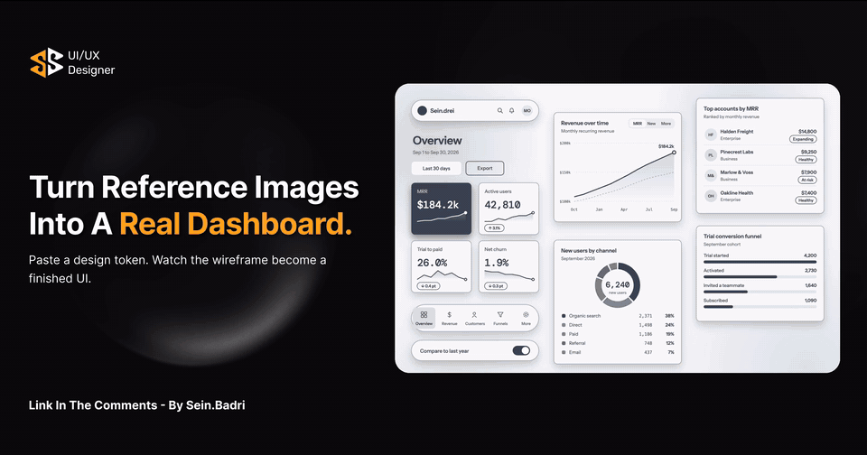
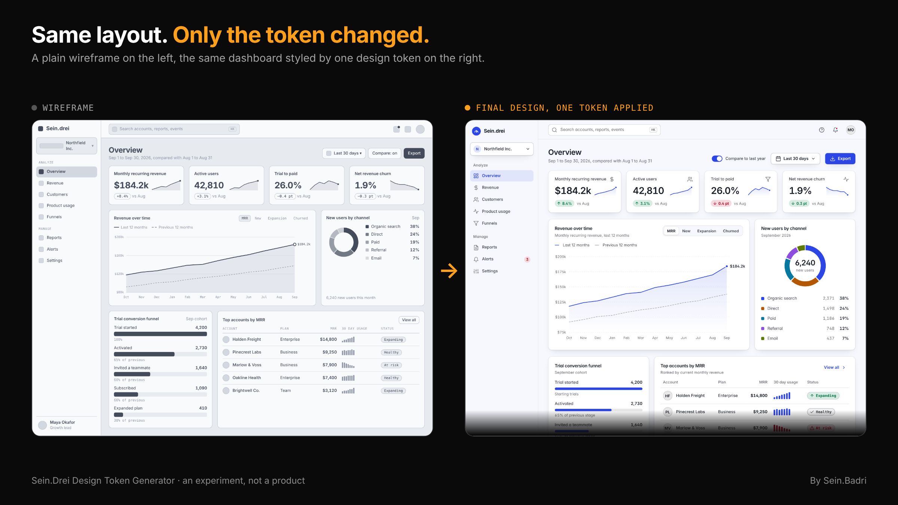
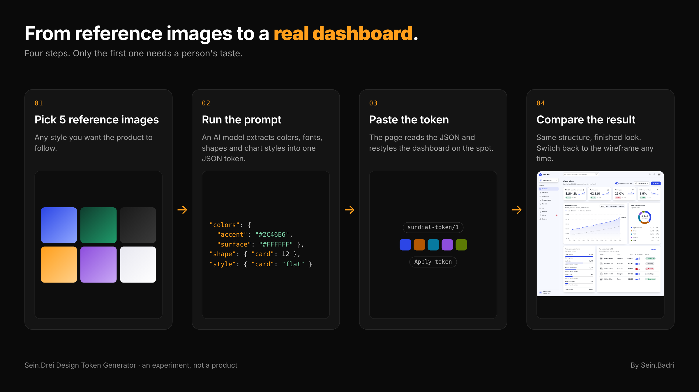

# Sein.Drei Design Token Generator

**Paste a design token. Watch a plain wireframe become a finished UI.**

[](https://seinhb.github.io/Design-Token-Generator/)
[](ARTICLE_URL)



> **Status: an experiment, not a product.** This is a small, hands-on test of one idea: that the design decisions a team has already made can be written down once as a token and applied to any wireframe. It covers the visual layer only, and it has not been tested with users.

---

## The idea

Most teams review a wireframe, approve it, and then spend days or weeks turning it into the final design. That second step repeats decisions the team already made: colors, type, spacing, corner radius, how a button or a status label looks.

A **design token** is a named design decision stored as data. If those decisions live in one token, a wireframe can be restyled by swapping the token, with no layout changes and no redrawing.

This project lets you try that. It shows one SaaS analytics dashboard in two states, a grey wireframe and a finished design, and the only thing that changes between them is the token.



## Try it

1. Open the **[live generator](https://seinhb.github.io/Design-Token-Generator/)**.
2. Pick one of the five built-in tokens, or paste your own token JSON.
3. Switch between **Wireframe** and **Final design** and compare.

## How it works



1. **Pick 5 reference images** that show the style you want the product to follow.
2. **Copy the prompt from the page** and give it to an AI model together with your images. It extracts one token: sampled colors, the closest Google Font, corner radii, depth, how chips, status labels, buttons and tabs should look, and five chart colors.
3. **Paste the JSON** the model returns into the box on the page.
4. **Apply the token.** The dashboard restyles itself on the spot, on desktop (1280 px) and mobile (390 px).
5. **Compare** the final design with the wireframe to check that only the look changed.

The prompt also sets accessibility guardrails: chart colors must be clearly different hues with at least 3:1 contrast against the card, and main text must reach at least 7:1 contrast on its background.

## What is in the page

- A wireframe of a SaaS analytics dashboard with a left navigation, search bar, KPI cards, line chart, donut chart, funnel and accounts table, in desktop and mobile sizes.
- Eight numbered notes that explain why each part of the layout sits where it does.
- A **Wireframe / Final design** toggle and a **Replay animation** button.
- **Five built-in tokens:** Clean Light Minimal, Dark Technical, Glass Fintech, Liquid Metal Neon and Mono Tactile.
- A **custom token** box that accepts your own JSON, with the extraction prompt built in.
- A **Share** button that exports the result as a PNG in Story (9:16), Poster or Mobile layouts.

## Token format

Tokens use a small JSON schema (`sundial-token/1`). This is the built-in example:

```json
{
  "schema": "sundial-token/1",
  "name": "Clean Light Minimal",
  "mode": "light",
  "fonts": {
    "ui": "Geist",
    "numbers": "Geist",
    "weights": { "body": 400, "heading": 600, "figure": 600, "button": 600 }
  },
  "colors": {
    "canvas": "#F6F8FE",
    "canvasEnd": "#F6F8FE",
    "surface": "#FFFFFF",
    "ink": "#181D27",
    "accent": "#2C46E6",
    "primary": "#2C46E6",
    "positive": "#038149",
    "negative": "#BB011D",
    "warning": "#956804"
  },
  "chart": ["#2C46E6", "#B35703", "#0779A0", "#8D4EDD", "#5C7A04"],
  "shape": { "card": 12, "control": 8, "chip": 999, "avatar": 999 },
  "style": {
    "card": "flat",
    "shadow": "soft",
    "chip": "soft",
    "status": "pill",
    "button": "solid",
    "tabs": "soft",
    "nav": "soft",
    "background": "solid",
    "gradientAngle": 135,
    "iconStroke": 1.75,
    "uppercaseLabels": false,
    "density": "comfortable"
  },
  "type": { "figureSize": 30, "headingSize": 24 },
  "motion": { "speed": "calm", "hoverLift": 2 }
}
```

The full list of allowed values for each key is in the prompt inside the page.

## Run it locally

The whole tool is one file with no build step and no dependencies.

```bash
git clone https://github.com/seinhb/Design-Token-Generator.git
cd Design-Token-Generator
# open index.html in your browser
```

The page loads its fonts from Google Fonts, so it needs an internet connection to show them correctly.

## Where this goes next

The experiment only restyles one dashboard. The larger idea is a company token that also holds a team's agreed rules for **product, flow and wireframing decisions**, so anyone with an idea can sketch a wireframe and see it in the company's own style. Next, I want to test the same approach on other steps of the design process, and to test the results with real users on usability, flow, time on task and success rate.

## Related work

This idea is not new, and other people are working on it from different directions:

- [Design Tokens specification, first stable version](https://www.w3.org/community/design-tokens/2025/10/28/design-tokens-specification-reaches-first-stable-version/) (W3C Design Tokens Community Group, October 2025)
- [DESIGN.md open-source format](https://blog.google/innovation-and-ai/models-and-research/google-labs/stitch-design-md/) (Google, April 2026)
- [Building an Agentic Design System](https://josefrichter.design/blog/agentic-design-system) (Josef Richter)

The article linked above goes into these and the limits of this experiment in more detail.

## Feedback

If you try the generator, I would like to hear what worked, what broke, and what you would add. Leave a comment on my LinkedIn post or send me a message.

**Sein Badri**, UI/UX and design systems designer
[LinkedIn](https://www.linkedin.com/in/sein-badri/) · [Article](ARTICLE_URL) · [Live demo](https://seinhb.github.io/Design-Token-Generator/)
